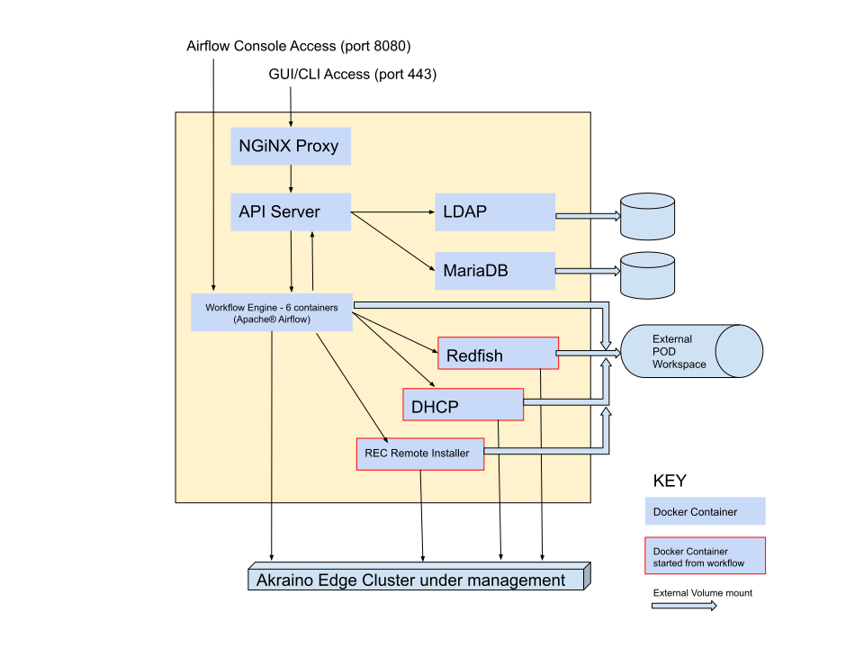

..
      Copyright (c) 2019 AT&T Intellectual Property. All Rights Reserved.

      Licensed under the Apache License, Version 2.0 (the "License");
      you may not use this file except in compliance with the License.
      You may obtain a copy of the License at

          http://www.apache.org/licenses/LICENSE-2.0

      Unless required by applicable law or agreed to in writing, software
      distributed under the License is distributed on an "AS IS" BASIS, WITHOUT
      WARRANTIES OR CONDITIONS OF ANY KIND, either express or implied. See the
      License for the specific language governing permissions and limitations
      under the License.

.. _start:

Starting the RC
================
The RC may run on any host machine with the following requirements:

- a relatively recent version of Docker
- high speed networking connectivity to the Edgesites that will be deployed
- access to the Internet for downloading Blueprints, Docker images, etc.

There is one shell script, ``start_arc.sh``, that may be downloaded and run to start the RC.
This script takes no command line parameters; some internal values may be changed by
setting and exporting certain environment variables.  For example:

.. code-block:: bash

  export DROOT=/opt/arc
  ./start_arc.sh

============  ================================================ ===========================================================
Variable      Default value                                    Purpose
============  ================================================ ===========================================================
DROOT         /data                                            The root of the directory tree for volumes shared with the containers.
DOMAIN        akraino.demo                                     The domain under which all these containers run.
PREFIX        arc                                              The prefix used when naming the Docker containers.
PW            abc123                                           The password used for the databases.
NETWORK       ${PREFIX}-net                                    The name of the Docker network that all containers run on.
CERTDIR       ${DROOT}/nginx/cert                              Alternate directory to pass to NGiNX for the SSL certificates.
API_IMAGE     nexus3.akraino.org:10003/akraino/arc_api:latest  The Docker image used for the API server.
AF_IMAGE      nexus3.akraino.org:10003/akraino/airflow:latest  The Docker image used for the Apache Airflow workflow engine.
DB_IMAGE      mariadb:10.4                                     The Docker image used for the database.
LDAP_IMAGE    osixia/openldap:1.2.3                            The Docker image used for the LDAP server.
============  ================================================ ===========================================================

NGiNX will only allow HTTPS (port 443) access.
It comes with some built in SSL certificates, that are self-signed and are for the
domain ``arc.akraino.demo``.
These are intended for demo use only; you will probably want to get your own certificates.
To replace the default certificates, set the ``$CERTDIR`` variable to the directory containing
your certificates.  These MUST be named ``akraino.crt`` and ``akraino.key``.

Internal Structure of the RC
=============================
Internally, the RC consists of about a dozen Docker containers.

